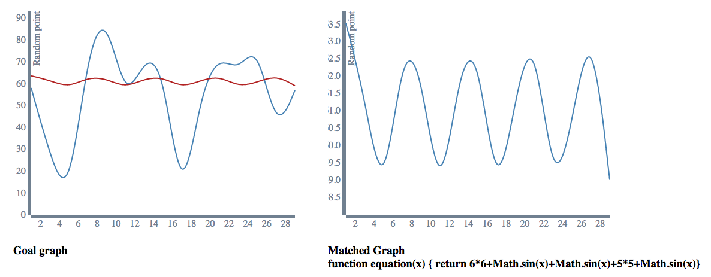
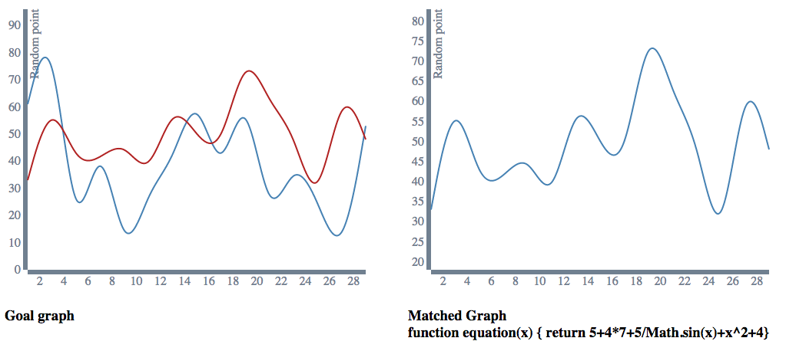

##Genetic algorithm

In this project we generate random points to a plot line graph consisting of 
these points. We use a genetic algorithm to approximate the equation for these 
points. 

The display is written in D3 and javascript but the server and genetic algorithm 
are written entirely in clojure.

##Examples 

####Generated by code
For  goal graph - blue is randomly generated, red is our match.

####Generated by code 
For  goal graph - blue is randomly generated, red is our match.

##Setup and run

    lein run -m myapp.core

Then navigate your browser to localhost:5000 to see some graphs
